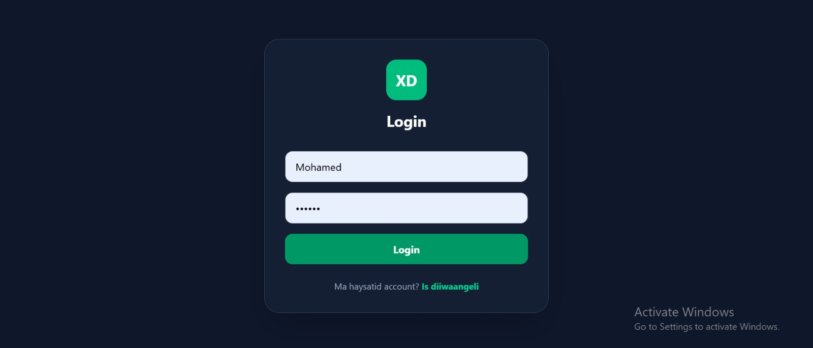
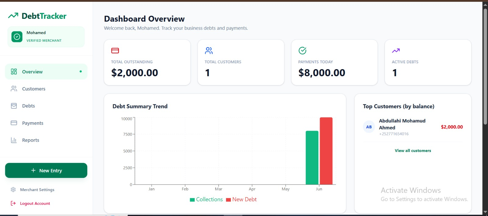
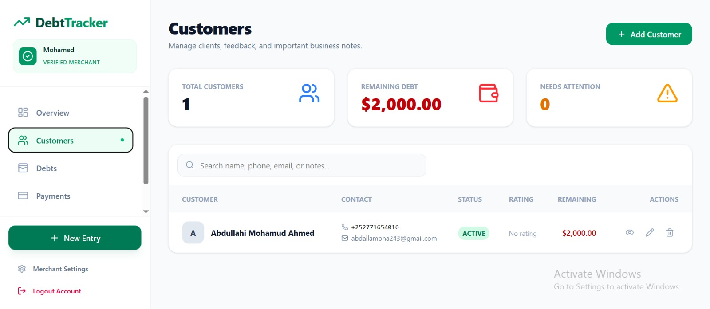
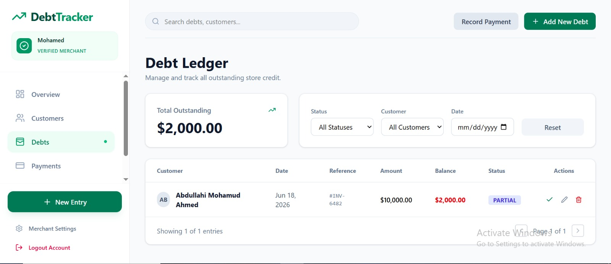
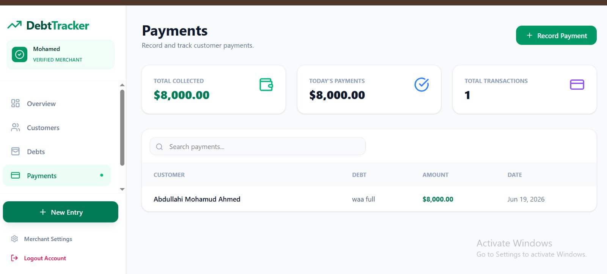

# 💰 XisaabDeyn

### Smart Debt Management for Shops & Small Businesses

**XisaabDeyn** is a full-stack debt management application built for shops and small businesses. It helps merchants track customers, manage debts, record payments, monitor customer feedback, and generate business reports from a single dashboard.

---

## 📸 Screenshots

### Login



### Dashboard



### Customers



### Debts



### Payments



---

## ✨ Features

| Module            | Capabilities                                                                                                                     |
| ----------------- | -------------------------------------------------------------------------------------------------------------------------------- |
| 📊 Overview       | Live statistics, debt trend chart, top customers, recent transactions, customers needing attention, recent feedback              |
| 👥 Customers      | Create, update, delete, search customers, email support, business notes, customer status, satisfaction ratings, feedback history |
| 💳 Debts          | Create debts, edit records, delete debts, filter debts, mark as paid, record payments                                            |
| 💰 Payments       | Record partial/full payments and view payment history                                                                            |
| 📈 Reports        | Debt summaries, collections, outstanding balances, status analytics                                                              |
| ⚙️ Settings       | Merchant profile management                                                                                                      |
| 🔐 Authentication | Secure registration, login, JWT-based authentication                                                                             |

---

## 🌟 Customer Feedback & Account Management

Each customer profile includes:

* Email address
* Important business information
* Credit terms and reminders
* Customer status tracking
* Satisfaction rating (1–5 stars)
* Feedback history

### Customer Status Types

| Status  | Description                                   |
| ------- | --------------------------------------------- |
| Active  | Customer is in good standing                  |
| Warning | Payment delays or issues detected             |
| Blocked | Customer should not receive additional credit |

### Feedback Types

* General Feedback
* Complaint
* Praise
* Internal Note

The dashboard automatically highlights customers who need attention and displays recent feedback activity.

---

## 🚀 Tech Stack

### Frontend

* React 19
* Vite
* Tailwind CSS 4
* Redux Toolkit
* React Router
* Recharts
* Lucide React

### Backend

* Express 5
* MongoDB
* Mongoose
* JWT Authentication
* bcrypt Password Hashing

### Database

* MongoDB

---

## 📁 Project Structure

```text
XisaabDeyn/
├── backend/
│   ├── Auth/
│   ├── config/
│   ├── controllers/
│   ├── Middleware/
│   ├── models/
│   ├── routes/
│   └── server.js
│
├── frontend/
│   └── src/
│       ├── auth/
│       ├── components/
│       ├── layouts/
│       ├── pages/
│       └── utils/
│
├── screenshots/
│   ├── dashboard.png
│   ├── customers.png
│   ├── debts.png
│   └── payments.png
│
└── README.md
```

---

## 🔌 API Endpoints

### Authentication

| Method | Endpoint             | Description    |
| ------ | -------------------- | -------------- |
| POST   | `/api/auth/register` | Create account |
| POST   | `/api/auth/login`    | Login          |

### Customers

| Method | Endpoint                      | Description          |
| ------ | ----------------------------- | -------------------- |
| GET    | `/api/customers`              | List customers       |
| GET    | `/api/customers/:id`          | Get customer details |
| POST   | `/api/customers`              | Create customer      |
| PUT    | `/api/customers/:id`          | Update customer      |
| DELETE | `/api/customers/:id`          | Delete customer      |
| POST   | `/api/customers/:id/feedback` | Add feedback         |

### Debts

| Method | Endpoint         | Description |
| ------ | ---------------- | ----------- |
| GET    | `/api/debts`     | List debts  |
| POST   | `/api/debts`     | Create debt |
| PUT    | `/api/debts/:id` | Update debt |
| DELETE | `/api/debts/:id` | Delete debt |

### Payments

| Method | Endpoint        | Description    |
| ------ | --------------- | -------------- |
| GET    | `/api/payments` | List payments  |
| POST   | `/api/payments` | Record payment |

> All routes except authentication require:
>
> ```http
> Authorization: Bearer <token>
> ```

---

## 🏁 Getting Started

### Prerequisites

Before running the project, ensure you have:

* Node.js 18+
* MongoDB (Local or Atlas)
* Git

---

## ⚙️ Backend Setup

```bash
cd backend
npm install
```

Create a `.env` file inside the backend folder:

```env
MONGO_URI=mongodb://127.0.0.1:27017/xisaabdeyn
JWT_SECRET=your_secret_key_here
PORT=5000
```

Run the backend:

```bash
npm run dev
```

Backend runs on:

```text
http://localhost:5000
```

---

## 🎨 Frontend Setup

```bash
cd frontend
npm install
npm run dev
```

Frontend runs on:

```text
http://localhost:5173
```

The frontend automatically proxies API requests to:

```text
http://localhost:5000
```

---

## 💳 Debt Status Values

| Status  | Meaning             |
| ------- | ------------------- |
| Pending | No payment received |
| Partial | Partially paid      |
| Paid    | Fully paid          |

---

## 📊 Reports Included

* Total Debt
* Total Collections
* Outstanding Balance
* Paid vs Pending Debts
* Customer Status Breakdown
* Recent Transactions
* Debt Trends

---

## 🔒 Security

* Password hashing using bcrypt
* JWT authentication
* Protected API routes
* User-based data isolation
* Secure token storage

Each merchant can only access their own customers, debts, payments, and reports.

---

## 🌍 Use Cases

Perfect for:

* Grocery Stores
* Retail Shops
* Pharmacies
* Electronics Stores
* Wholesale Businesses
* Small & Medium Enterprises

---

## 🔮 Future Improvements

* SMS Notifications
* Email Reminders
* PDF Report Export
* Multi-user Roles
* Inventory Integration
* Mobile Application
* Dark Mode

---

## 👨‍💻 Author

Developed by **Abdalla Moha**

GitHub:
https://github.com/cabdalle8180

---

## 📄 License

ISC License


<!-- # XisaabDeyn (DebtTracker)

**XisaabDeyn** — Somali for *accounting* (*xisaab*) and *debt* (*deyn*) — is a full-stack debt management app for shops and small businesses. Track customers, record debts, collect payments, and manage customer feedback in one place.

---

## Features

| Module | Capabilities |
|--------|-------------|
| **Overview** | Live stats, debt trend chart, top customers, recent transactions, customers needing attention, recent feedback |
| **Customers** | CRUD, search, email, important business notes, account status (active/warning/blocked), satisfaction rating, feedback log |
| **Debts** | Create, edit, delete, filter, mark as paid, record payments |
| **Payments** | List all payments, record partial/full payments against debts |
| **Reports** | Total debt, collections, outstanding balance, status breakdown |
| **Settings** | Merchant profile (name, email, phone) |
| **Auth** | Register, login, JWT sessions with persistent storage |

---

## Customer Feedback & Important Information

Each customer profile supports:

- **Email** — optional contact email
- **Important Information** — payment terms, credit limits, reminders, special agreements
- **Account Status** — `active`, `warning`, or `blocked`
- **Satisfaction Rating** — 1–5 star rating
- **Feedback Log** — timestamped entries with types:
  - General Feedback
  - Complaint
  - Praise
  - Internal Note

Feedback can be added from the customer detail panel (click a customer name or the eye icon). The dashboard overview highlights customers needing attention and shows recent feedback.

---

## Tech Stack

- **Frontend:** React 19, Vite, Tailwind CSS 4, Redux Toolkit, React Router, Recharts
- **Backend:** Express 5, Mongoose, JWT, bcrypt
- **Database:** MongoDB

---

## Project Structure

```
XisaabDeyn/
├── backend/
│   ├── Auth/              # Login & register
│   ├── config/            # MongoDB connection
│   ├── controllers/       # Business logic
│   ├── Middleware/        # JWT auth guard
│   ├── models/            # User, Customer, Debt, Payment
│   ├── routes/            # API routes
│   └── server.js
└── frontend/
    └── src/
        ├── auth/          # Redux auth slice
        ├── components/    # Overview, Customers, Debts, Payments
        ├── layouts/       # Dashboard layout with sidebar
        ├── pages/         # Login, Signup, Reports, Settings
        └── utils/         # API helper & formatters
```

---

## API Endpoints

| Method | Endpoint | Description |
|--------|----------|-------------|
| POST | `/api/auth/register` | Create account |
| POST | `/api/auth/login` | Login |
| GET | `/api/customers` | List customers |
| GET | `/api/customers/:id` | Get customer details |
| POST | `/api/customers` | Create customer |
| PUT | `/api/customers/:id` | Update customer |
| DELETE | `/api/customers/:id` | Delete customer |
| POST | `/api/customers/:id/feedback` | Add feedback entry |
| GET | `/api/debts` | List debts |
| POST | `/api/debts` | Create debt |
| PUT | `/api/debts/:id` | Update debt |
| DELETE | `/api/debts/:id` | Delete debt |
| GET | `/api/payments` | List payments |
| POST | `/api/payments` | Record payment |

All routes except auth require `Authorization: Bearer <token>`.

---

## Getting Started

### Prerequisites

- Node.js 18+
- MongoDB (local or Atlas)

### Backend setup

```bash
cd backend
npm install
```

Create `backend/.env`:

```env
MONGO_URI=mongodb://127.0.0.1:27017/xisaabdeyn
JWT_SECRET=your_secret_key_here
PORT=5000
```

```bash
npm run dev
```

### Frontend setup

```bash
cd frontend
npm install
npm run dev
```

Open the URL shown by Vite (usually `http://localhost:5173`). The frontend proxies `/api` to `http://localhost:5000`.

---

## Debt Status Values

| Status | Meaning |
|--------|---------|
| `pending` | No payment received |
| `partial` | Partially paid |
| `paid` | Fully paid |

---

## Customer Status Values

| Status | Meaning |
|--------|---------|
| `active` | Customer in good standing |
| `warning` | Late payments or issues — needs follow-up |
| `blocked` | Do not extend further credit |

---

## Important Notes

- Each merchant only sees their own customers, debts, and payments (scoped by `userId`).
- Recording a payment automatically updates the linked debt balance and status.
- Customer `importantInfo` and `feedbackLog` are stored per customer and visible in the dashboard overview.
- Passwords are hashed with bcrypt; JWT tokens expire after 7 days.

---

## License

ISC -->

